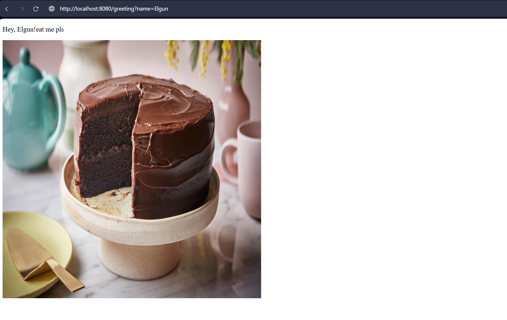

Spring Greeting App

This is a simple spring boot application made for the Java labs course.  
It demonstrates REST and MVC patterns using spring web and thymeleaf.

--------------------

How to Run

1. Open the project in IntelliJ
2. Run the application (DemoApplication.java)
3. Open browser and test:

- [http://localhost:8080/](http://localhost:8080/)
- [http://localhost:8080/greeting?name=Elgun](http://localhost:8080/greeting?name=Elgun)

The app displays a greeting message and a cake image
## Screenshot with parameter in URL

